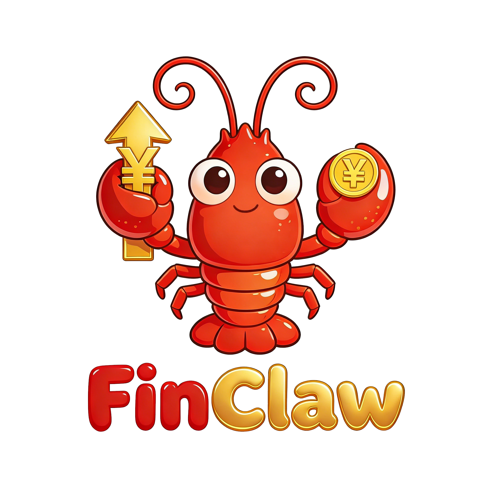

<div align="center">
  
</div>

# FinClaw 🦞 | 首个开源金融专属龙虾，1000+ 金融专属Skills全量免费

[](https://nodejs.org/)
[](LICENSE)
[](package.json)
[](#-skills-分类概览)
[]()

> **开箱即用的金融数据投研神器 —— 精选 60个 核心金融 Skills，开源 1000+ Skills，6 只金融龙虾，覆盖 银行、券商、保险、基金、期货、信托全品类，赋能全赛道金融人！无需 API Key，一键上手！**

[English](README_EN.md) | [中文](README.md)

---

**FinClaw**


## 💡 场景应用 

### 🦞**银行龙虾 | 对公授信+自营投资专属智囊**
FinClaw银行龙虾能够围绕授信审批、行业研究、资产配置等核心场景，快速生成行业信用风险监测清单、自营账户大类资产配置思路等专业结果，把大量重复性的前期分析工作先做起来。

https://github.com/user-attachments/assets/ab34d9f8-03d4-4f6c-b306-fc9093595448

### 🦞**证券龙虾 | 投研研判+业务拓展精准雷达**
FinClaw证券龙虾能够从投行尽调底稿、行业投研覆盖排序，到机构路演核心议题、两融业务测算，精准捕捉政策与市场主线，让投研与经纪业务直接踩中节奏。

https://github.com/user-attachments/assets/a1aed73b-7c8f-4c4f-8bbb-3cd41273c109

### 🦞**保险龙虾 | 负债匹配+资产配置定制专家**
FinClaw保险龙虾能够结合险企负债结构、利率环境与风险偏好，生成更贴近实际业务场景的大类资产配置思路，同时覆盖产品对比、保障分析、核保理赔、合规风控等常见任务。

https://github.com/user-attachments/assets/8b257662-ba41-4599-b343-984e9d3e0af9

### 🦞**基金龙虾 | 净值归因+业绩诊断精准手术刀**
FinClaw基金龙虾能够一键拆解ETF跑输基准的核心原因，定位拖累净值的重仓股，区分基本面/交易面/事件面影响，覆盖投研回测、绩效归因、持仓合规、FOF组合构建全链路。

https://github.com/user-attachments/assets/df331043-d43e-4046-a88f-2a34e306fd58

### 🦞**期货龙虾 | 行情复盘+交易研判全天候操盘手**

FinClaw期货龙虾能够分钟级完成主力合约复盘，拆解日内拐点、量仓变化、跨期价差、产业驱动，精准定性尾盘波动是趋势延续、情绪宣泄还是短线错杀，量化与主观交易者均能开箱即用。

https://github.com/user-attachments/assets/22b3fee0-7e70-445d-8007-f624c193f0b4

### 🦞**信托龙虾 | 非标业务+财富传承专属架构师**

FinClaw信托龙虾能够针对家族信托、高净值客户服务、非标估值、ABS测算、政信风控等场景，生成资产适配诊断、风险识别、受益分配框架与控制权安排建议，辅助完成更完整的方案设计。

https://github.com/user-attachments/assets/327c53c8-9c6d-4283-89d0-5b47c7197918

---

## 🌟 FinClaw 核心亮点

FinClaw **以金融业务全流程闭环为核心，从底层数据到上层应用形成完整链路**。系统采用分层架构设计，将金融能力与任务执行进行解耦与重构。底层通过 Skills库 沉淀标准化的金融任务能力，上层由统一的任务编排与调度机制对能力进行动态组合与调用，从而实现从“工具调用”向“任务执行”的跃迁。

### 1️⃣ 60个精选自研金融 Skills，突破专业壁垒
针对**银行、证券、基金、保险、期货、信托六大金融行业特性**，对高频业务能力进行定向筛选与深度适配，弥补通用 AI 在专业场景中的能力不足。基于典型金融业务流程，对相关能力进行标准化抽象与结构化沉淀，**构建高质量、可复用的 Skills 能力集，实现从数据获取、处理分析到结果输出的全流程一站式支持**。能力体系统一接入多源真实数据，确保任务执行过程的稳定性、一致性与专业性。

#### 银行套件 (10个)
| Skill | 功能描述 | 数据源 |
|:---|:---|:---|
| `bank-industry-analyzer` | 银行业整体分析（总资产、净利润、ROE） | 央行/金融监管总局 |
| `bank-financial-analyzer` | 单家银行财务分析 | 年报+腾讯行情 |
| `bank-valuation-analyzer` | 银行估值分析（PB/PE/股息率） | 实时行情+财务 |
| `bank-nim-analyzer` | 净息差(NIM)分析对比 | 银行年报 |
| `bank-risk-analyzer` | 风险指标分析（不良率/拨备覆盖率） | 银行年报 |
| `bank-liquidity-analyzer` | 流动性指标分析（LCR/NSFR） | 银行年报 |
| `bank-deposit-rates` | 存款利率查询对比 | 银行官网+LPR |
| `bank-interbank-market` | 银行间市场分析（Shibor/回购） | 交易中心 |
| `bank-credit-analyzer` | 信贷收支分析 | 央行统计 |
| `bank-wealth-products` | 理财产品分析 | 中国理财网 |

#### 证券套件 (10个)
| Skill | 功能描述 | 数据源 |
|:---|:---|:---|
| `securities-industry-analyzer` | 证券业整体分析 | 证券业协会 |
| `securities-financial-analyzer` | 券商财务分析（ROE/杠杆率） | 年报数据 |
| `securities-valuation-analyzer` | 券商估值分析 | 实时行情+财务 |
| `securities-brokerage-analyzer` | 经纪业务分析（成交/市占率） | 交易所 |
| `securities-ib-analyzer` | 投行业务分析（IPO/承销） | 证券业协会 |
| `securities-margin-analyzer` | 两融业务分析 | 沪深交易所 |
| `securities-proprietary-analyzer` | 自营业务分析 | 券商年报 |
| `securities-am-analyzer` | 资管业务分析 | 中基协 |
| `securities-rating-analyzer` | 券商评级分析 | 证监会分类评价 |
| `securities-policy-analyzer` | 行业政策分析 | 监管公告 |

#### 期货套件 (10个)
| Skill | 功能描述 | 数据源 |
|:---|:---|:---|
| `futures-market-overview` | 期货市场概览 | 五大交易所 |
| `commodity-futures-analyzer` | 商品期货分析（季节性/基差） | 交易所数据 |
| `financial-futures-analyzer` | 金融期货分析（股指期货基差） | 中金所 |
| `futures-volume-analyzer` | 成交持仓分析 | 交易所 |
| `futures-position-tracker` | 持仓追踪（龙虎榜） | 交易所 |
| `futures-arbitrage-analyzer` | 套利分析（跨品种/跨期） | 历史价差统计 |
| `futures-risk-analyzer` | 风险分析（VaR/波动率） | 历史数据 |
| `futures-margin-calculator` | 保证金计算器 | 交易所标准 |
| `futures-macro-correlation` | 宏观相关性分析 | 历史统计 |
| `futures-delivery-analyzer` | 交割分析 | 合约信息 |

#### 保险套件 (10个)
| Skill | 功能描述 | 数据源 |
|:---|:---|:---|
| `insurance-market-overview` | 保险市场概览 | 金融监管总局 |
| `insurance-company-analyzer` | 保险公司分析 | 公司年报 |
| `insurance-life-analyzer` | 寿险业务分析（NBV/代理人） | 公司年报 |
| `insurance-pc-analyzer` | 财险业务分析（综合成本率） | 公司年报 |
| `insurance-investment-analyzer` | 投资资产配置分析 | 公司年报 |
| `insurance-valuation-analyzer` | 保险估值（PEV/内含价值） | 实时行情+精算 |
| `insurance-solvency-analyzer` | 偿付能力分析 | 偿付能力报告 |
| `insurance-policy-tracker` | 保单追踪分析 | 公司公告 |
| `insurance-sector-comparison` | 行业对比分析 | 行业统计 |
| `insurance-hot-events` | 热点事件分析 | 新闻舆情 |

#### 基金套件 (10个)
| Skill | 功能描述 | 数据源 |
|:---|:---|:---|
| `fund-market-research` | 基金市场研究 | 中基协/三方 |
| `fund-screener` | 基金筛选器 | 多源数据 |
| `fund-risk-analyzer` | 基金风险分析（VaR/最大回撤） | 历史净值 |
| `fund-portfolio-allocation` | 资产配置（SAA/TAA/Markowitz） | 多源数据 |
| `fund-sip-planner` | 定投计划/智能定投 | 历史数据 |
| `fund-rebalance-advisor` | 再平衡顾问 | 持仓数据 |
| `fund-attribution-analysis` | 归因分析（Brinson/因子） | 持仓+收益 |
| `fund-holding-analyzer` | 持仓穿透分析 | 持仓数据 |
| `fund-tax-optimizer` | 税务优化（赎回/税损收割） | 交易记录 |
| `fund-monitor` | 基金监控预警 | 实时数据 |

#### 信托套件 (10个)
| Skill | 功能描述 | 数据源 |
|:---|:---|:---|
| `trust-market-research` | 信托市场研究 | 用益信托/协会 |
| `trust-product-analyzer` | 信托产品分析 | 产品公告 |
| `trust-risk-manager` | 信托风险管理 | 多维度评估 |
| `trust-compliance-checker` | 合规审查 | 监管规则 |
| `trust-income-calculator` | 收益计算（IRR/XIRR） | 现金流 |
| `family-trust-designer` | 家族信托设计 | 规则引擎 |
| `charity-trust-manager` | 慈善信托管理 | 公益数据 |
| `trust-valuation-engine` | 估值引擎 | 多方法估值 |
| `trust-post-investment-monitor` | 投后监控 | 项目数据 |
| `trust-asset-allocation` | 资产配置优化 | 优化算法 |

---

### 2️⃣ 1000+ 自研金融 Skills
FinClaw 的 Skills 体系并不是按照金融行业简单拆分，而是从更底层的能力结构出发，对金融业务中的通用能力进行抽象与标准化沉淀。这些能力在实际使用中可以被灵活编排与组合，从而**自然延展至银行、证券、基金、保险、期货、信托六大核心金融应用场景**。

| 类别 | 数量 | 覆盖内容 |
|:---|:---:|:---|
| 🏦 **银行业务** | 155 | 对公/零售/财富管理/风险管理/合规运营 |
| 💼 **投研助手** | 357 | 公司研究/行业研究/公告分析/尽职调查 |
| 📊 **A股投研** | 174 | 估值/财报/技术/资金/情绪/宏观/选股 |
| 🛡️ **保险业务** | 87 | 核保/理赔/产品/保障/营销/合规 |
| 📈 **基金业务** | 42 | 筛选/配置/定投/归因/监控 |
| 📉 **证券业务** | 20 | 经纪/投行/资管/融资融券 |
| 🏛️ **信托业务** | 20 | 产品分析/家族信托/投后监控 |
| 🗄️ **数据源** | 60 | AkShare/同花顺/东财/巨潮/FRED等 |
| ⚠️ **风控合规** | 33 | 合规检查/风险预警/监管报送 |
| 🧰 **通用工具** | 54 | 文档处理/前端设计/技能创建 |
| 📰 **舆情新闻** | 8 | 财经新闻/情感分析/舆情监控 |
| 🤖 **量化工具** | 8 | 回测/因子/组合优化/可视化 |
| 📎 **其他** | 7 | AI选股/商品数据/原子化任务 |

**全部免费 · 无需注册 · 即装即用**

---

### 3️⃣ 统一金融数据抽象层
构建**标准化的数据访问层，基于 cn-stock-data 封装多源金融数据接口**，实现跨数据源的统一 schema、代码规范与访问协议。系统通过智能路由与容错降级机制，动态调度 AkShare、东财、同花顺、巨潮等数据源，屏蔽底层差异并保障数据服务稳定性，使上层 Agent 与 Skills 可以以一致接口完成数据调用。

```
用户请求 → cn-stock-data（统一入口）→ 智能路由 → efinance / akshare / adata / ashare / snowball
```

| 数据类型 | 路由优先级 |
|:---|:---|
| K线行情 | efinance → akshare → adata → ashare → snowball |
| 实时报价 | efinance → adata → snowball |
| 财务指标 | adata → akshare → snowball |
| 北向资金 | adata 独占 |
| 跨市场 | snowball 独占 |

**统一代码格式（SH600519）、统一字段名（英文 snake_case）、自动 Fallback，上层 Skill 无需关心数据源差异。**

---

### 4️⃣ 容器化一键部署
FinClaw **在支持标准化本地安装的同时，提供基于 Docker 的容器化部署方案**，将运行环境、依赖组件与核心服务进行统一封装，实现开箱即用的一键启动。通过容器隔离机制有效规避环境冲突，提升系统稳定性与可复现性，并在数据与业务层面提供更高的安全保障。同时，该方案具备良好的可扩展性与环境适配能力，能够无缝支持企业级部署与生产环境落地。
**标准安装（推荐）**
```
# 1. 安装 OpenClaw
curl -fsSL https://openclaw.ai/install.sh | bash

# 2. 克隆 FinClaw
cd ~/.openclaw/workspace
git clone https://github.com/aifinlab/FinClaw .

# 3. 安装依赖
pip install akshare pandas numpy requests

# 4. 启动
openclaw start
```
**Docker 部署**
```
# 1. 启动 OpenClaw 容器
docker run -d --name openclaw -p 18789:18789 openclaw/openclaw:latest

# 2. 复制 FinClaw 到容器
docker exec openclaw mkdir /home/node/.openclaw/workspace/
docker cp ./FinClaw openclaw:/home/node/.openclaw/workspace/FinClaw

# 3. 重启容器
docker restart openclaw
```

---

### 5️⃣ 零门槛任务执行能力
FinClaw 原生兼容 OpenClaw Agent OS 架构，能够无缝接入其消息路由、会话管理、技能注册与权限控制体系。**系统无需额外 API Key 或复杂环境配置，通过标准化启动方式即可完成部署，实现开箱即用的金融任务执行能力**。用户可直接在对话环境中调用对应金融 Skills，并与通用能力实现统一编排与协同执行。
**方式一：通过 OpenClaw Agent 调用（推荐）**
启动后，直接在对话中与 OpenClaw 交互，例如：
- "查询茅台股票行情"
- "帮我做贵州茅台的 DCF 估值"
- "分析北向资金近期动向"
- "用动量策略回测沪深300成分股"
**方式二：命令行直接运行 Skills**
```
# 查看所有 skills
ls -1 skills/

# 按类别查找
ls -1 skills/ | grep "^bank-"        # 银行业务
ls -1 skills/ | grep "^a-share-"     # A股相关
ls -1 skills/ | grep "^fund-"        # 基金相关
```

---

## 🔧 故障排查

| 问题 | 解决方案 |
|:---|:---|
| OpenClaw 未安装 | `curl -fsSL https://openclaw.ai/install.sh \| bash` |
| Python依赖缺失 | `pip install akshare pandas requests` |
| Skills 找不到 | 确认路径：`~/.openclaw/workspace/FinClaw/skills` |

**检查安装状态**
```
# 检查 OpenClaw 是否安装
openclaw version

# 检查 skills 是否正确放置
openclaw config get skills.load.extraDirs

# 检查 Python 依赖
python -c "import akshare; print(akshare.__version__)"
```

---

## 📅 路线图

- ✅ **已完成**：1000+ Skills、统一数据抽象层、Docker部署、精选60个Skills
- 🚧 **进行中**：Web可视化界面、FinSkillsHub

---

## 🤝 贡献指南

欢迎提交Issue和PR！

```bash
git checkout -b feature/your-feature
git commit -m "feat: add new feature"
git push origin feature/your-feature
```

---

## 📫 联系我们

诚邀业界同仁共同探索AI与金融深度融合的创新范式，共建智慧金融新生态。欢迎通过邮件联系：
📧 [zhang.liwen@shufe.edu.cn](mailto:zhang.liwen@shufe.edu.cn)
📧 [chengdongpo@mail.sufe.edu.cn](mailto:chengdongpo@mail.sufe.edu.cn)

👉若你希望在项目共建、科学研究、人才培养和产业应用等方向深入交流，请扫码填表。
<div align="center">
  
</div>

---

## 📄 许可证

[Apache 2.0](LICENSE) © 2026 FinClaw Contributors

