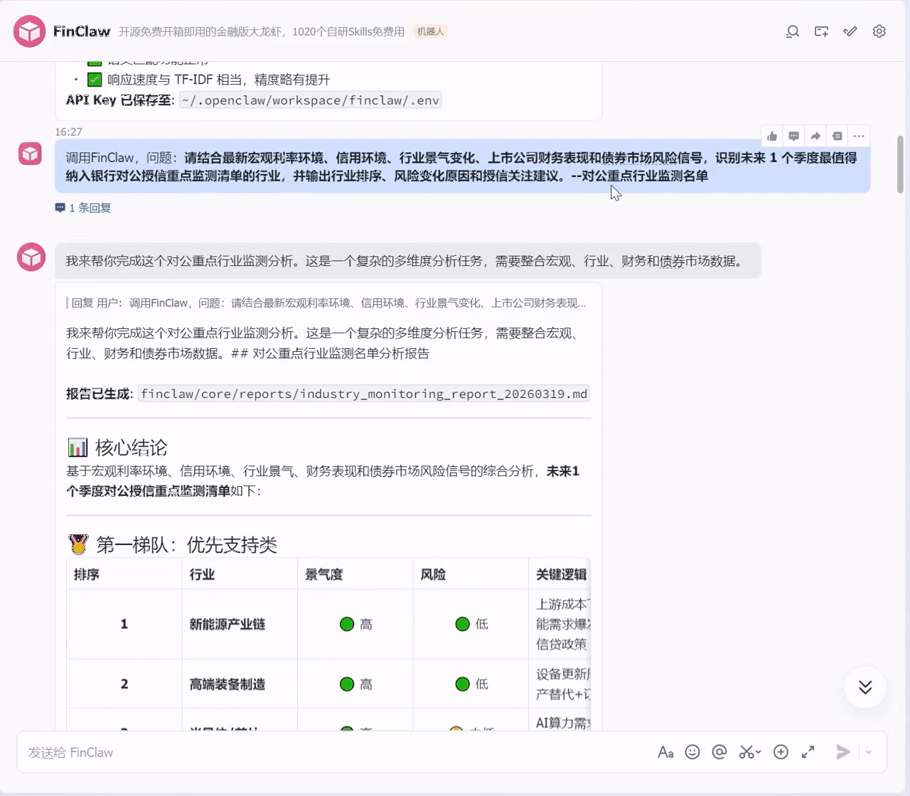

<div align="center">
  

  <h1>FinClaw 🦞 | The First Open-Source Finance-Dedicated Lobster with 1000+ Financial Skills Fully Free</h1>

  <p>
    <a href="https://nodejs.org/">
      
    </a>
    <a href="LICENSE">
      
    </a>
    <a href="package.json">
      
    </a>
    <a href="#-skills-overview">
      
    </a>
    
  </p>

  <p>
    📄<a href="README_EN.md">English</a> |
    <a href="README.md">中文</a>
  </p>
</div>

**FinClaw** is the first open-source autonomous AI agent execution framework designed specifically for the financial industry. It is jointly developed by the Artificial Intelligence Finance Lab (AIFinLab), led by **Professor Liwen Zhang, Director of the Shanghai Financial Intelligence Engineering Technology Research Center and faculty of the School of Statistics and Data Science at Shanghai University of Finance and Economics**.

Rather than being a generic-purpose agent, FinClaw is **structured into six specialized “financial lobsters,” enabling AI agents to think and act like seasoned financial professionals**. It focuses on deeply vertical financial scenarios, covering six core sectors: banking, securities, insurance, funds, futures, and trusts, while adapting to each sector’s unique business processes, regulatory requirements, and application scenarios.

## 📌 Table of Contents<a name="toc"></a>   
  - [💡 Application Scenarios](#summary) 
    - [🦞 Banking Lobster | Corporate Credit + Proprietary Investment Think Tank](#banking-lobster)
    - [🦞 Securities Lobster | Research Intelligence + Business Expansion Radar](#securities-lobster)
    - [🦞 Insurance Lobster | Liability Matching + Asset Allocation Expert](#insurance-lobster)
    - [🦞 Fund Lobster | NAV Attribution + Performance Diagnosis Scalpel](#fund-lobster)
    - [🦞 Futures Lobster | Market Replay + Trading Decision Operator](#futures-lobster)
    - [🦞 Trust Lobster | Non-Standard Assets + Wealth Structuring Architect](#trust-lobster)
  - [🌟 Core Highlights](#core-highlights)
    - [1️⃣ 60 Curated Financial Skills](#60-curated-skills)
    - [2️⃣ 1000+ Financial Skills](#1000-skills)
    - [3️⃣ Unified Financial Data Abstraction Layer](#data-layer)
    - [4️⃣ Containerized One-Click Deployment](#deployment)
    - [5️⃣ Zero-Barrier Task Execution](#task-execution)
  - [🔧 Troubleshooting](#troubleshooting)
  - [📅 Roadmap](#roadmap)
  - [🤝 Contribution Guide](#contribution)
  - [💡 Future Outlook](#todo) 
  - [📫 Contact Us](#contact)
  - [⭐ Star History](#star)


## 💡 Application Scenarios  <a name="summary"></a>  

### 🦞 **Six Financial Lobsters**

| Lobster | Positioning | Core Capabilities |
|:---|:---|:---|
| Banking Lobster | Corporate Credit + Proprietary Investment Think Tank | Credit approval, industry research, asset allocation, credit risk monitoring |
| Fund Lobster | NAV Attribution + Performance Diagnosis Scalpel | Backtesting, performance attribution, compliance checks, FOF portfolio construction |
| Securities Lobster | Research Intelligence + Business Expansion Radar | Investment banking due diligence, research, roadshows, margin trading |
| Insurance Lobster | Liability Matching + Asset Allocation Expert | Product comparison, protection analysis, underwriting & claims, compliance |
| Trust Lobster | Non-standard Assets + Wealth Structuring Architect | Family trust, valuation, ABS modeling, government financing risk |
| Futures Lobster | Market Replay + Trading Decision Operator | Contract replay, spread analysis, industrial drivers |

---

### 🦞 **Banking Lobster | Dedicated Think Tank for Corporate Credit + Proprietary Investment** <a name="banking-lobster"></a> 
FinClaw’s Banking Lobster can rapidly generate professional outputs for core scenarios such as credit approval, industry research, and asset allocation, including industry credit risk monitoring lists and strategic asset allocation ideas for proprietary accounts. It helps front-load a large amount of repetitive preliminary analysis work.


https://github.com/user-attachments/assets/1db084f2-1cd4-417d-989a-636ea281cd1e


### 🦞 **Securities Lobster | Precision Radar for Investment Research + Business Expansion** <a name="securities-lobster"></a>
FinClaw’s Securities Lobster can accurately capture policy signals and market themes across workflows ranging from investment banking due diligence materials and industry research coverage prioritization to key institutional roadshow topics and margin financing/securities lending analysis, helping both research and brokerage businesses stay in sync with the market rhythm.


https://github.com/user-attachments/assets/bf20305f-1bb4-4ced-b63b-c9f7f3710d0d


### 🦞 **Banking Lobster | Corporate Credit + Proprietary Investment Think Tank**  <a name="banking-lobster"></a>  

FinClaw’s banking lobster focuses on credit approval, industry research, and asset allocation. It can quickly generate credit risk monitoring lists and portfolio allocation strategies, significantly reducing repetitive analytical workload.

<div align="center">
  
</div>

---

### 🦞 **Securities Lobster | Research Intelligence + Business Expansion Radar**  <a name="securities-lobster"></a>  

It supports investment banking due diligence, industry coverage ranking, roadshow topic extraction, and margin business analysis, enabling precise alignment with policy and market trends.

<div align="center">
  
</div>

---

### 🦞 **Insurance Lobster | Liability Matching + Asset Allocation Expert**  <a name="insurance-lobster"></a>  

Combining liability structures, interest rate environments, and risk preferences, it generates realistic asset allocation strategies and supports underwriting, claims, and compliance workflows.

<div align="center">
  
</div>

---

### 🦞 **Fund Lobster | NAV Attribution + Performance Diagnosis Scalpel**  <a name="fund-lobster"></a>  

It decomposes underperformance, identifies drag factors, and distinguishes between fundamental, trading, and event-driven impacts across the full investment lifecycle.

<div align="center">
  
</div>

---

### 🦞 **Futures Lobster | Market Replay + Trading Decision Operator**  <a name="futures-lobster"></a>  

Capable of minute-level contract replay, identifying turning points, volume/position changes, spreads, and industrial drivers.

<div align="center">
  
</div>

---

### 🦞 **Trust Lobster | Non-Standard Assets + Wealth Structuring Architect**  <a name="trust-lobster"></a>  

Supports family trust design, high-net-worth wealth planning, valuation, and risk structuring.

<div align="center">
  
</div>

---

## 🌟 Core Highlights of FinClaw <a name="core-highlights"></a>

FinClaw centers on a full closed loop for financial business workflows, forming a complete chain from underlying data to upper-layer applications. The system adopts a layered architecture that decouples and reconstructs financial capabilities and task execution. At the bottom layer, a Skills library accumulates standardized financial task capabilities. At the top layer, a unified task orchestration and scheduling mechanism dynamically combines and invokes these capabilities, enabling a leap from mere “tool calling” to true “task execution.”

### 1️⃣ 60 Carefully Selected In-House Financial Skills That Break Through Professional Barriers  <a name="60-curated-skills"></a>

Tailored to the characteristics of the six major financial industries — banking, securities, funds, insurance, futures, and trusts — FinClaw selectively curates and deeply adapts high-frequency business capabilities to fill the gap left by general AI in professional scenarios. Based on typical financial business workflows, related capabilities are abstracted and structured into standardized, reusable modules, building a high-quality and reusable Skills capability set that supports the entire pipeline from data acquisition and processing to analysis and result output. The capability system is uniformly connected to multiple real-world data sources to ensure stability, consistency, and professionalism during task execution.

#### Banking Suite (10 Skills)

| Skill | Description | Data Source |
|:---|:---|:---|
| `bank-industry-analyzer` | Banking industry overview analysis (total assets, net profit, ROE) | PBOC / NFRA |
| `bank-financial-analyzer` | Single-bank financial analysis | Annual reports + Tencent market data |
| `bank-valuation-analyzer` | Bank valuation analysis (PB/PE/dividend yield) | Real-time market data + financials |
| `bank-nim-analyzer` | Net interest margin (NIM) comparative analysis | Bank annual reports |
| `bank-risk-analyzer` | Risk metrics analysis (NPL ratio / provision coverage) | Bank annual reports |
| `bank-liquidity-analyzer` | Liquidity metrics analysis (LCR / NSFR) | Bank annual reports |
| `bank-deposit-rates` | Deposit rate query and comparison | Bank websites + LPR |
| `bank-interbank-market` | Interbank market analysis (Shibor / repo) | Trading center |
| `bank-credit-analyzer` | Credit balance analysis | PBOC statistics |
| `bank-wealth-products` | Wealth management product analysis | China Wealth Management Net |

#### Securities Suite (10 Skills)

| Skill | Description | Data Source |
|:---|:---|:---|
| `securities-industry-analyzer` | Securities industry overview analysis | Securities Association of China |
| `securities-financial-analyzer` | Broker financial analysis (ROE / leverage ratio) | Annual report data |
| `securities-valuation-analyzer` | Broker valuation analysis | Real-time market data + financials |
| `securities-brokerage-analyzer` | Brokerage business analysis (trading volume / market share) | Exchanges |
| `securities-ib-analyzer` | Investment banking business analysis (IPO / underwriting) | Securities Association of China |
| `securities-margin-analyzer` | Margin trading and securities lending analysis | SSE / SZSE |
| `securities-proprietary-analyzer` | Proprietary trading business analysis | Broker annual reports |
| `securities-am-analyzer` | Asset management business analysis | AMAC |
| `securities-rating-analyzer` | Broker rating analysis | CSRC classification evaluations |
| `securities-policy-analyzer` | Industry policy analysis | Regulatory announcements |

#### Futures Suite (10 Skills)

| Skill | Description | Data Source |
|:---|:---|:---|
| `futures-market-overview` | Futures market overview | Five major exchanges |
| `commodity-futures-analyzer` | Commodity futures analysis (seasonality / basis) | Exchange data |
| `financial-futures-analyzer` | Financial futures analysis (stock index futures basis) | CFFEX |
| `futures-volume-analyzer` | Volume and open interest analysis | Exchanges |
| `futures-position-tracker` | Position tracking (top traders list) | Exchanges |
| `futures-arbitrage-analyzer` | Arbitrage analysis (cross-product / calendar spread) | Historical spread statistics |
| `futures-risk-analyzer` | Risk analysis (VaR / volatility) | Historical data |
| `futures-margin-calculator` | Margin calculator | Exchange standards |
| `futures-macro-correlation` | Macro correlation analysis | Historical statistics |
| `futures-delivery-analyzer` | Delivery analysis | Contract information |

#### Insurance Suite (10 Skills)

| Skill | Description | Data Source |
|:---|:---|:---|
| `insurance-market-overview` | Insurance market overview | NFRA |
| `insurance-company-analyzer` | Insurance company analysis | Company annual reports |
| `insurance-life-analyzer` | Life insurance business analysis (NBV / agents) | Company annual reports |
| `insurance-pc-analyzer` | Property & casualty insurance business analysis (combined ratio) | Company annual reports |
| `insurance-investment-analyzer` | Investment asset allocation analysis | Company annual reports |
| `insurance-valuation-analyzer` | Insurance valuation (PEV / embedded value) | Real-time market data + actuarial data |
| `insurance-solvency-analyzer` | Solvency analysis | Solvency reports |
| `insurance-policy-tracker` | Policy tracking analysis | Company announcements |
| `insurance-sector-comparison` | Industry comparison analysis | Industry statistics |
| `insurance-hot-events` | Hot-topic event analysis | News and public opinion |

#### Fund Suite (10 Skills)

| Skill | Description | Data Source |
|:---|:---|:---|
| `fund-market-research` | Fund market research | AMAC / third-party sources |
| `fund-screener` | Fund screener | Multi-source data |
| `fund-risk-analyzer` | Fund risk analysis (VaR / max drawdown) | Historical NAV |
| `fund-portfolio-allocation` | Asset allocation (SAA / TAA / Markowitz) | Multi-source data |
| `fund-sip-planner` | SIP planning / smart DCA | Historical data |
| `fund-rebalance-advisor` | Rebalancing advisor | Holding data |
| `fund-attribution-analysis` | Attribution analysis (Brinson / factor) | Holdings + returns |
| `fund-holding-analyzer` | Look-through holding analysis | Holding data |
| `fund-tax-optimizer` | Tax optimization (redemption / tax-loss harvesting) | Trading records |
| `fund-monitor` | Fund monitoring and alerting | Real-time data |

#### Trust Suite (10 Skills)

| Skill | Description | Data Source |
|:---|:---|:---|
| `trust-market-research` | Trust market research | Use Trust / associations |
| `trust-product-analyzer` | Trust product analysis | Product announcements |
| `trust-risk-manager` | Trust risk management | Multi-dimensional evaluation |
| `trust-compliance-checker` | Compliance review | Regulatory rules |
| `trust-income-calculator` | Return calculator (IRR / XIRR) | Cash flow |
| `family-trust-designer` | Family trust design | Rule engine |
| `charity-trust-manager` | Charity trust management | Public welfare data |
| `trust-valuation-engine` | Valuation engine | Multi-method valuation |
| `trust-post-investment-monitor` | Post-investment monitoring | Project data |
| `trust-asset-allocation` | Asset allocation optimization | Optimization algorithms |

### 2️⃣ 1000+ In-House Financial Skills <a name="1000-skills"></a>

FinClaw’s Skills system is not simply divided by financial sectors. Instead, it starts from a deeper capability structure and abstracts the common capabilities across financial business scenarios into standardized modules. In practical use, these capabilities can be flexibly orchestrated and combined, thereby naturally extending into six core financial application scenarios: banking, securities, funds, insurance, futures, and trusts.

| Category | Count | Coverage |
|:---|:---:|:---|
| 🏦 Banking | 155 | Corporate / retail / wealth management / risk management / compliance operations |
| 💼 Investment Research Assistant | 357 | Company research / industry research / announcement analysis / due diligence |
| 📊 A-Share Research | 174 | Valuation / financial reports / technicals / capital flows / sentiment / macro / stock selection |
| 🛡️ Insurance | 87 | Underwriting / claims / products / protection / marketing / compliance |
| 📈 Funds | 42 | Screening / allocation / SIP / attribution / monitoring |
| 📉 Securities | 20 | Brokerage / investment banking / asset management / margin financing |
| 🏛️ Trusts | 20 | Product analysis / family trusts / post-investment monitoring |
| 🗄️ Data Sources | 60 | AkShare / Tonghuashun / Eastmoney / CNINFO / FRED, etc. |
| ⚠️ Risk Control & Compliance | 33 | Compliance checks / risk alerts / regulatory reporting |
| 🧰 General Tools | 54 | Document processing / frontend design / skill creation |
| 📰 News & Sentiment | 8 | Financial news / sentiment analysis / public opinion monitoring |
| 🤖 Quant Tools | 8 | Backtesting / factors / portfolio optimization / visualization |
| 📎 Others | 7 | AI stock selection / commodity data / atomic tasks |

**Completely free · No registration required · Install and use immediately**

### 3️⃣ Unified Financial Data Abstraction Layer  <a name="data-layer"></a>

FinClaw builds a standardized data access layer by wrapping multi-source financial data interfaces based on cn-stock-data, enabling a unified schema, code format, and access protocol across data sources. Through intelligent routing and fault-tolerant degradation, the system dynamically dispatches between sources such as AkShare, Eastmoney, Tonghuashun, and CNINFO, shielding upper layers from source-level differences while ensuring service stability. This allows upper-layer Agents and Skills to invoke data through a consistent interface.

```text
User Request → cn-stock-data (Unified Entry) → Intelligent Routing → efinance / akshare / adata / ashare / snowball
```

| Data Type | Routing Priority |
|:---|:---|
| K-line market data | efinance → akshare → adata → ashare → snowball |
| Real-time quotes | efinance → adata → snowball |
| Financial indicators | adata → akshare → snowball |
| Northbound capital | adata exclusive |
| Cross-market data | snowball exclusive |

**Unified code format (SH600519), unified field names (English snake_case), and automatic fallback — upper-layer Skills do not need to care about data source differences.**

### 4️⃣ One-Click Containerized Deployment <a name="deployment"></a>  

In addition to supporting standardized local installation, FinClaw provides a Docker-based containerized deployment solution that packages the runtime environment, dependencies, and core services into a unified bundle for out-of-the-box startup. Container isolation effectively avoids environment conflicts, improves system stability and reproducibility, and offers stronger protection at both the data and business levels. At the same time, this approach has strong scalability and environment adaptability, making it suitable for seamless enterprise deployment and production use.

**Standard Installation (Recommended)**

```bash
# 1. Install OpenClaw
curl -fsSL https://openclaw.ai/install.sh | bash

# 2. Clone FinClaw
cd ~/.openclaw/workspace
git clone https://github.com/aifinlab/FinClaw .

# 3. Install dependencies
pip install akshare pandas numpy requests

# 4. Start
openclaw start
```

**Docker Deployment**
```
# 1. Start the OpenClaw container
docker run -d --name openclaw -p 18789:18789 openclaw/openclaw:latest

# 2. Copy FinClaw into the container
docker exec openclaw mkdir /home/node/.openclaw/workspace/
docker cp ./FinClaw openclaw:/home/node/.openclaw/workspace/FinClaw

# 3. Restart the container
docker restart openclaw
```

---

### 5️⃣ Zero-Barrier Task Execution Capability  <a name="task-execution"></a>
FinClaw is natively compatible with the OpenClaw Agent OS architecture and can seamlessly integrate with its message routing, session management, skill registration, and permission control system. The system requires no additional API Key or complex environment configuration. Deployment can be completed through a standardized startup process, delivering out-of-the-box financial task execution capability. Users can directly invoke the corresponding financial Skills in a conversational environment and orchestrate them together with general-purpose capabilities.

**Method 1: Invoke via OpenClaw Agent (Recommended)**

After startup, interact directly with OpenClaw in conversation, for example:
- "Check the stock price trend of Kweichow Moutai"
- "Help me do a DCF valuation for Kweichow Moutai"
- ""Analyze recent northbound capital movements"
- "Backtest a momentum strategy on CSI 300 constituents"

**Method 2: Run Skills directly from the command line**
```
# View all skills
ls -1 skills/

# Find by category
ls -1 skills/ | grep "^bank-"        # Banking
ls -1 skills/ | grep "^a-share-"     # A-share related
ls -1 skills/ | grep "^fund-"        # Funds
```

---

## 🔧 Troubleshooting  <a name="troubleshooting"></a> 

| Issue | Solution |
|:---|:---|
| OpenClaw not installed | `curl -fsSL https://openclaw.ai/install.sh` |
| Missing Python dependencies | `pip install akshare pandas requests` |
| Skills not found | Confirm path: `~/.openclaw/workspace/FinClaw/skills` |

### Check installation status

```bash
# Check whether OpenClaw is installed
openclaw version

# Check whether skills are correctly placed
openclaw config get skills.load.extraDirs

# Check Python dependencies
python -c "import akshare; print(akshare.__version__)"
```

---

## 📅 Roadmap  <a name="roadmap"></a>

- ✅ **Completed**：1000+ Skills, unified data abstraction layer, Docker deployment, 60 curated Skills
- 🚧 **In Progress**：Web visualization interface, FinSkillsHub

---

## 🤝 Contributing  <a name="contribution"></a>

Issues and PRs are welcome!

```bash
git checkout -b feature/your-feature
git commit -m "feat: add new feature"
git push origin feature/your-feature
```

---

## 💡 Future Outlook <a name="todo"></a>


## 📫 Contact Us

We sincerely invite industry peers to explore innovative paradigms for the deep integration of AI and finance and to jointly build a new ecosystem for intelligent finance. Feel free to contact us by email:

📧 [zhang.liwen@shufe.edu.cn](mailto:zhang.liwen@shufe.edu.cn)
📧 [chengdongpo@mail.sufe.edu.cn](mailto:chengdongpo@mail.sufe.edu.cn)

👉If you would like to engage in deeper discussions on project co-construction, scientific research, talent cultivation, or industrial applications, please scan the QR code and fill out the form.
<div align="center">
  
</div>

---

## 📄 If you would like to engage in deeper discussions on project co-construction, scientific research, talent cultivation, or industrial applications, please scan the QR code and fill out the form.

## ⭐ Star History <a name="star"></a>
<p align="center"> <a href="https://www.star-history.com/#aifinlab/aifinlab&Date">  </a> </p>
<div align="center">

⭐ If FinClaw helps you, please give us a star!

Made with ❤️ by AIFinLab

</div> ```

